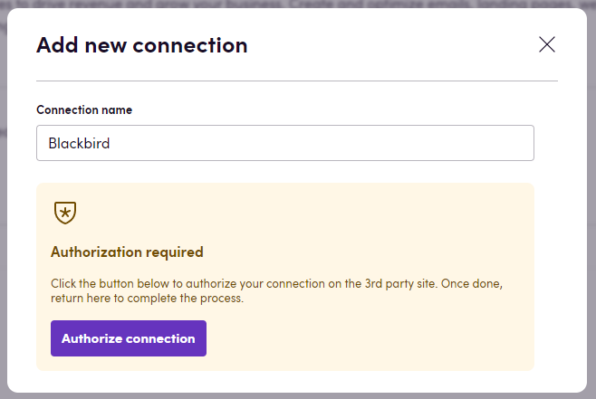

# Blackbird.io Mailchimp

Blackbird is the new automation backbone for the language technology industry. Blackbird provides enterprise-scale automation and orchestration with a simple no-code/low-code platform. Blackbird enables ambitious organizations to identify, vet and automate as many processes as possible. Not just localization workflows, but any business and IT process. This repository represents an application that is deployable on Blackbird and usable inside the workflow editor.

## Introduction

Mailchimp offers powerful features to drive revenue and grow your business. Create and optimize emails, landing pages, websites, and more with integrations, AI tools, and reporting.

<!-- begin docs -->

## Before setting up

You must ensure that you have a Mailchimp account and access to it. Our app uses OAuth 2.0 for authentication, so you don't need to provide any API keys. You will be redirected to the Mailchimp login page to authorize the app.

## Connecting

1. Navigate to Apps, and identify the **Mailchimp** app. You can use search to find it.
2. Click _Add Connection_.
3. Name your connection for future reference e.g. 'My organization'.
4. Click _Authorize connection_.
5. You will be redirected to the Mailchimp login page. Enter your credentials and authorize the app.
6. Confirm that the connection has appeared and the status is _Connected_.

## Actions

### Campaigns

- **Search campaigns** - Search campaigns by specified criteria.
- **Get campaign** - Get campaign by specified ID.
- **Create campaign** - Create campaign with specified data.
- **Update campaign** - Update campaign with specified data.
- **Delete campaign** - Delete campaign by specified ID.

### Campaign content

- **Get campaign content** - Get campaign content by specified ID.
- **Update campaign content** - Update campaign content with specified data.
- **Get campaign content as HTML** - Get campaign content by specified ID as HTML.
- **Update campaign content from HTML** - Update campaign content with specified ID from HTML file or optional input. This action is useful in pair with the `Get campaign content as HTML` action when you need to get the campaign content as HTML and then translate the document.

## Events

- **On campaigns created** - Polling event. Triggered after specified time interval and returns new campaigns.
- **On campaigns updated** - Polling event. Triggered after specified time interval and returns updated campaigns.

## Missing features

**Mailchimp** API is very extensive and we are working on adding more features to our app. If you need a specific feature, please reach out to us.

## Feedback

Do you want to use this app or do you have feedback on our implementation? Reach out to us using the [established channels](https://www.blackbird.io/) or create an issue.

<!-- end docs -->
